# Servicio de Atencion a Usuarios TIC-3.0

  

---

La aplicacion Web de Atención a Usuarios V3 de la Agenda Ambiental de la UASLP es una aplicación web que digitaliza por completo la gestión de solicitudes y servicios del departamento. Su arquitectura se basa en un BackEnd desarrollado con Laravel y un FrontEnd construido en React y TypeScript, conectado mediante Inertia.js. 

Sustituye procesos manuales (correos, llamadas y hojas de cálculo) por un sistema de tickets para seguimiento de solicitudes. Chat interno para comunicación en tiempo real. Dashboards interactivos con reportes y métricas instantáneas. Y control granular de acceso basado en roles (8 perfiles de usuario).

La autenticación y autorización se manejan con Laravel Breeze y un esquema de permisos dinámicos por roles, garantizando control de acceso granular para ocho perfiles de usuario. La plataforma utiliza MySQL como sistema de almacenamiento, con un esquema de quince tablas optimizadas y relaciones indexadas. El uso de Dashboards interactivos y la comunicación en tiempo real ofrecen métricas y reportes instantáneos para la mejora continua del servicio.

---

## ⚙️ Tecnologías

- Base de datos: MySQL
- Gestión de paquetes JS: NPM y YARN
- Backend: Laravel y PHP Composer
- Compilación: Vite + Laravel Blade
- Autenticación y rutas: Laravel Breeze + Ziggy
- Integración Frontend-Backend: Inertia.js
- Frontend: React + TypeScript
- Tipografia: Instrument Sans
- Estilos y diseño: Tailwind CSS
- Componentes UI: Lucide React + Radix UI
- Gráficas: ReCharts
- Pruebas: Pest & PHPUnit

---

## 🗄️ Diagrama de la Base de Datos

  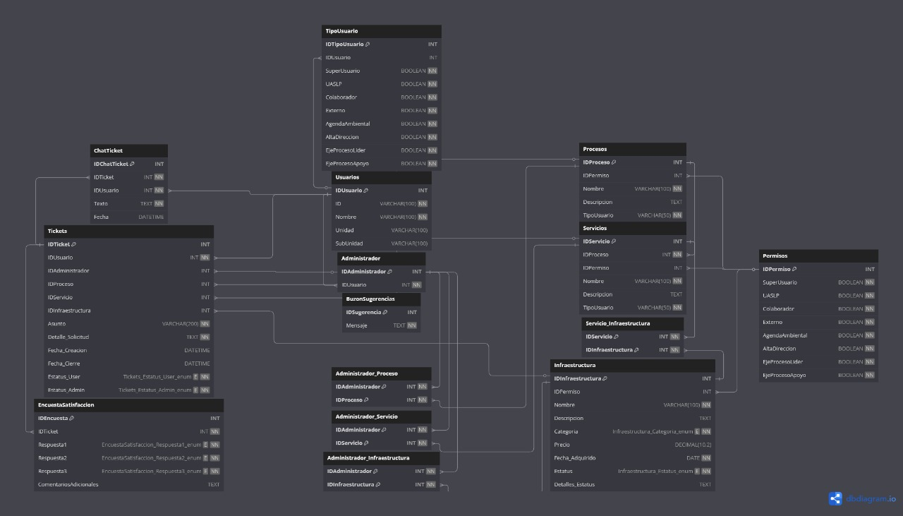

---

## 📁 Estructura de Carpetas y Archivos del Proyecto

    TIC-3.0/
    ├── app/                        # Código fuente principal de Laravel
    │   ├── Http/                   # Controladores, middleware, requests
    │   │   ├── Controllers/        # Controladores de la aplicación
    │   │   ├── Middleware/         # Middleware personalizado
    │   │   └── Requests/           # Validaciones de formularios
    │   ├── Models/                 # Modelos de Eloquent
    │   └── Providers/              # Proveedores de servicios
    │
    ├── bootstrap/                  # Archivos de arranque de Laravel
    │   └── cache/                  # Caché del framework
    │
    ├── config/                     # Archivos de configuración
    │
    ├── database/                   # Base de datos
    │   ├── factories/              # Factories para datos de prueba
    │   ├── migrations/             # Migraciones de la base de datos
    │   └── seeders/                # Seeders para poblar datos
    │
    ├── node_modules/               # Módulos de Node.js instalados
    │
    ├── public/                     # Punto de entrada público
    │   └── build/                  # Archivos compilados del frontend
    │       └── assets/             # Recursos estáticos (CSS, JS, imágenes)
    │
    ├── resources/                  # Recursos del frontend
    │   ├── css/                    # Estilos CSS
    │   ├── js/                     # Código fuente de React/TypeScript
    │   │   ├── components/         # Componentes reutilizables
    │   │   ├── hooks/              # Hooks personalizados
    │   │   ├── layouts/            # Estructuras de diseño
    │   │   ├── pages/              # Páginas de la aplicación
    │   │   └── types/              # Definiciones de TypeScript
    │   └── views/                  # Vistas de Blade
    │
    ├── routes/                     # Definición de rutas
    │
    ├── storage/                    # Almacenamiento de archivos
    │   ├── app/                    # Archivos generados por la app
    │   │   ├── private/            # Archivos privados
    │   │   └── public/             # Archivos públicos
    │   ├── framework/              # Caché, sesiones, vistas compiladas
    │   └── logs/                   # Logs de la aplicación
    │
    ├── tests/                      # Pruebas unitarias y funcionales
    │   ├── Feature/                # Pruebas de características
    │   └── Unit/                   # Pruebas unitarias
    │
    ├── vendor/                     # Dependencias de Composer
    │
    ├── .github/                    # Configuración de GitHub
    │
    ├── .idea/                      # Configuración de IntelliJ IDEA
    │
    ├── artisan                     # Script CLI de Laravel
    ├── components.json             # Configuración (posiblemente para Laravel/UI o similar)
    ├── composer.json               # Dependencias de PHP
    ├── composer.lock               # Lockfile de Composer
    ├── eslint.config.js            # Configuración de ESLint para JavaScript/TypeScript
    ├── package.json                # Dependencias de Node.js
    ├── package-lock.json           # Lockfile de npm
    ├── phpunit.xml                 # Configuración de PHPUnit
    ├── README.md                   # Documentación del proyecto
    ├── tsconfig.json               # Configuración de TypeScript
    ├── vite.config.ts              # Configuración de Vite
    │
    ├── .editorconfig               # Configuración de editor
    ├── .env                        # Archivo de configuración de entorno
    ├── .env.example                # Ejemplo de archivo de configuración de entorno
    ├── .gitattributes              # Configuración de Git
    ├── .gitignore                  # Archivos ignorados por Git
    ├── .prettierignore             # Archivos ignorados por Prettier
    └── .prettierrc                 # Configuración de Prettier

---

## 📋 Caracteristicas Tecnicas del Proyecto

El proyecto tiene una estructura limpia y ordenada con el Framework **Laravel** (BackEnd PHP) junto con un **FrontEnd moderno en React/TypeScript**. 

---

### 1. 🧱 **Backend: Laravel (PHP)** 
- **app/**: Código fuente principal de Laravel (controladores, modelos, middleware, etc.).
- **routes/**: Archivos de rutas de Laravel (`web.php`, `auth.php`, etc.).
- **config/**: Archivos de configuración de Laravel.
- **database/**: Migraciones, seeders y factories para la base de datos.
- **public/**: Punto de entrada público (index.php, assets).
- **bootstrap/**: Archivos de arranque de Laravel.
- **storage/**: Archivos generados, logs, caché, etc.
- **artisan**: Script CLI de Laravel.
- **composer.json / composer.lock**: Dependencias PHP (Laravel y paquetes).

---

### 2. 🎨 **Frontend: React/TypeScript**
- **resources/js/**: Código fuente del frontend en React y TypeScript.
  - **components/**: Componentes reutilizables de React.
  - **pages/**: Páginas principales de la aplicación.
  - **layouts/**: Layouts para estructurar las páginas.
  - **hooks/**, **lib/**, **types/**: Hooks personalizados, utilidades y tipos TypeScript.
- **resources/css/**: Archivos CSS.
- **package.json / package-lock.json**: Dependencias de Node.js (React, Vite, etc.).
- **vite.config.ts**: Configuración de Vite (bundler moderno para frontend).

---

### 3. 🧪 **Pruebas**
- **tests/**: Pruebas unitarias y funcionales (Pest y PHPUnit para Laravel).

---

## 🎨 Interfaces Gráficas del Administrador

  <h3>📈 Dashboard General</h3>
  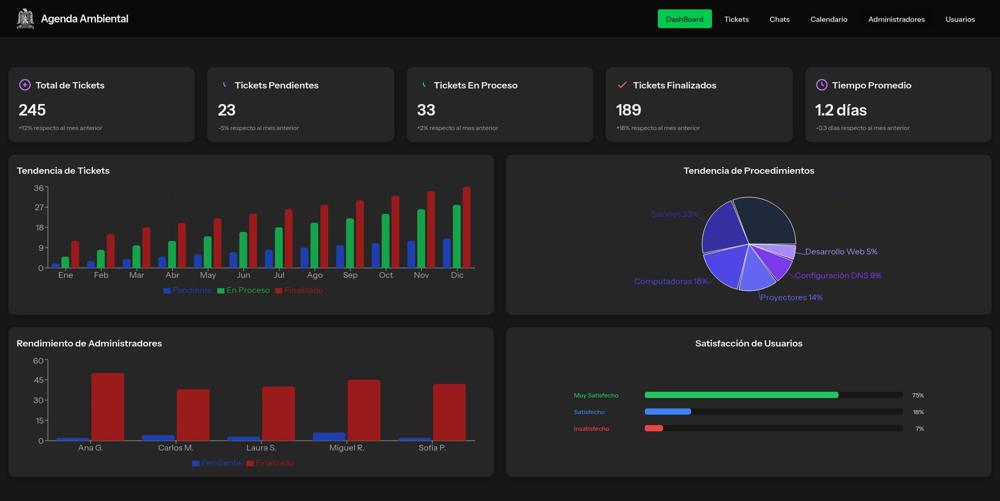
  
<em>📊 Vista general del panel administrativo, con KPIs y métricas en tiempo real.</em>

  <h3>🎟️ Gestión de Tickets</h3>
  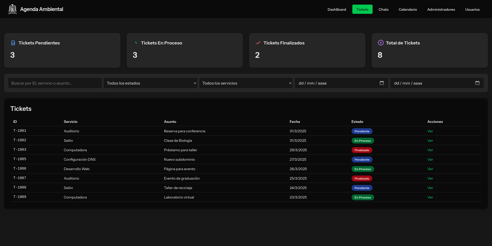
  
<em>🛠️ Panel para visualizar, asignar, atender y dar seguimiento a tickets generados por los usuarios.</em>

  <h3>💬 Módulo de Chats</h3>
  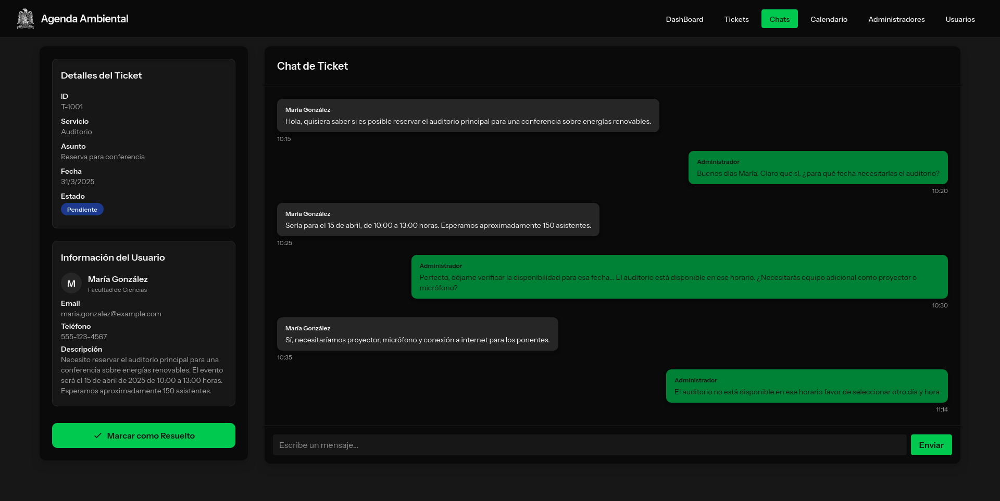
  
<em>📥 Comunicación directa con los usuarios mediante mensajes en tiempo real.</em>

  <h3>🗓️ Calendario de Actividades</h3>
  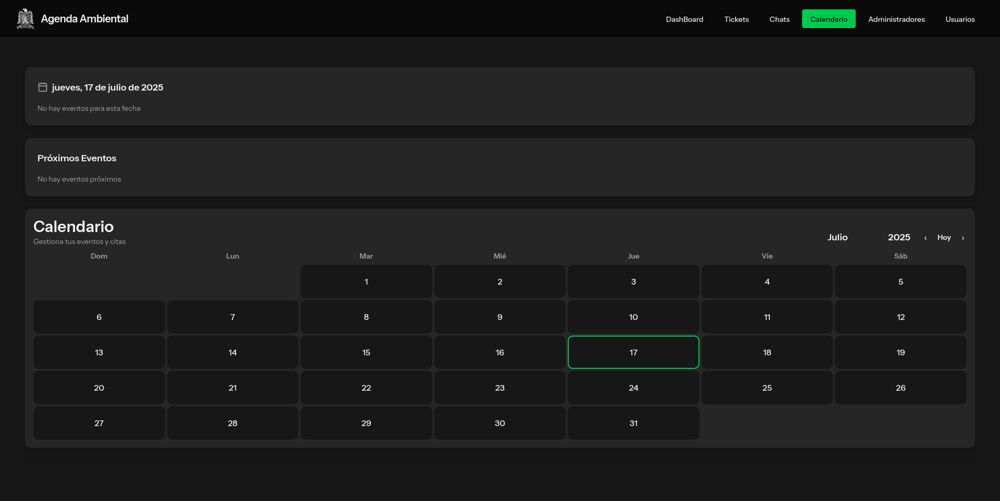
  
<em>📌 Programación y visualización de eventos, recordatorios y tareas importantes.</em>

  <h3>🧑‍💼 Gestión de Administradores</h3>
  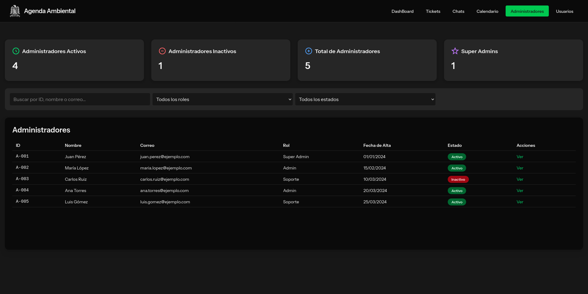
  
<em>🔧 Panel exclusivo para la Alta Dirección, donde se administran privilegios de los administradores.</em>

  <h3>👥 Gestión de Usuarios</h3>
  
  
<em>🔐 Administración de accesos y permisos de todos los usuarios registrados.</em>

  <h3>📥 Resultados Encuesta de Satisfacción</h3>
  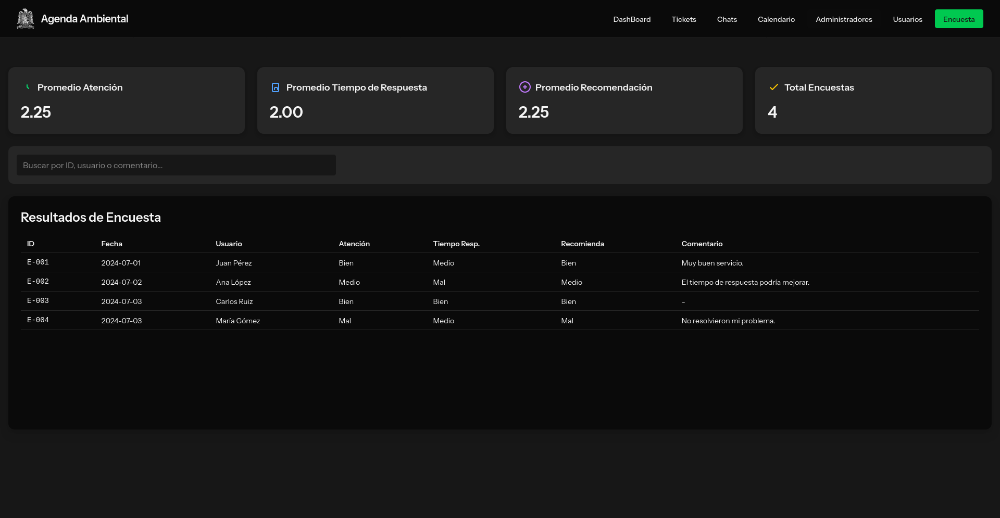
  
<em>🔧 Evaluación del servicio recibido para mejora continua del sistema.</em>

---

## 👤 Interfaces Gráficas del Usuario

  <h3>📊 Dashboard Personal</h3>
  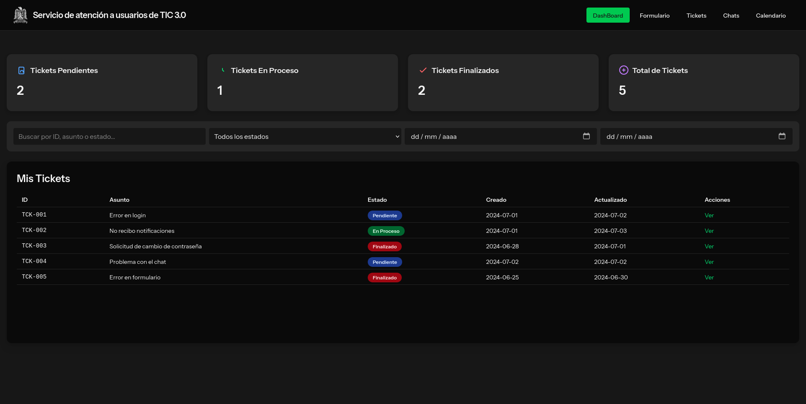
  
<em>🧭 Vista rápida de métricas personales y estado de tickets, mensajes y actividades recientes.</em>

  <h3>🎫 Formulario de Tickets</h3>
  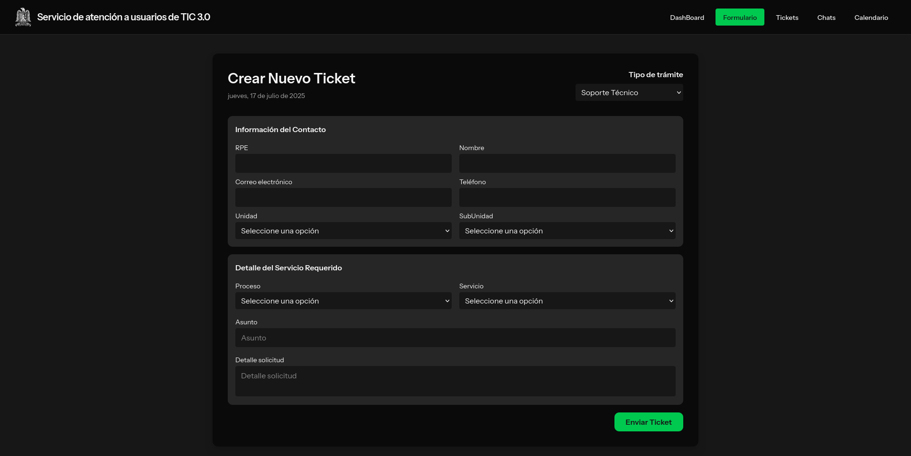
  
<em>📩 Formulario para generar solicitudes de atención mediante tickets.</em>

  <h3>🏢 Solicitud de Instalaciones</h3>
  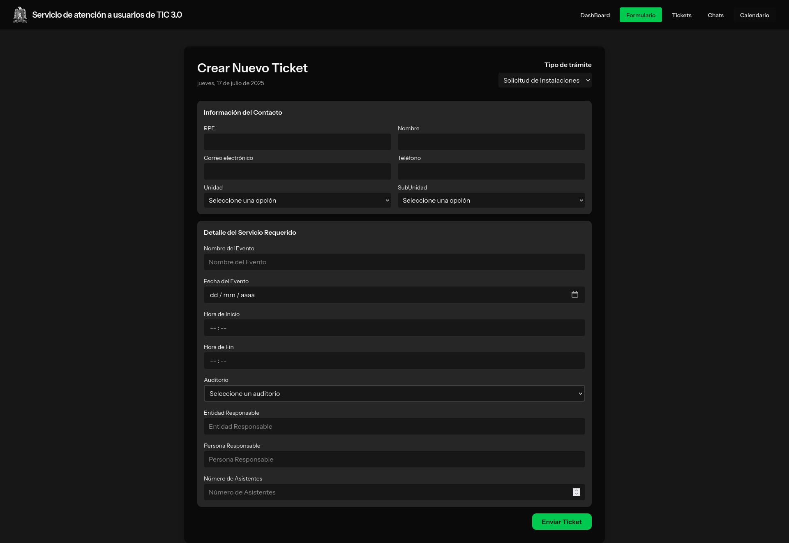
  
<em>📩 Formulario para solicitar uso de instalaciones específicas.</em>

  <h3>🎟️ Seguimiento de Tickets</h3>
  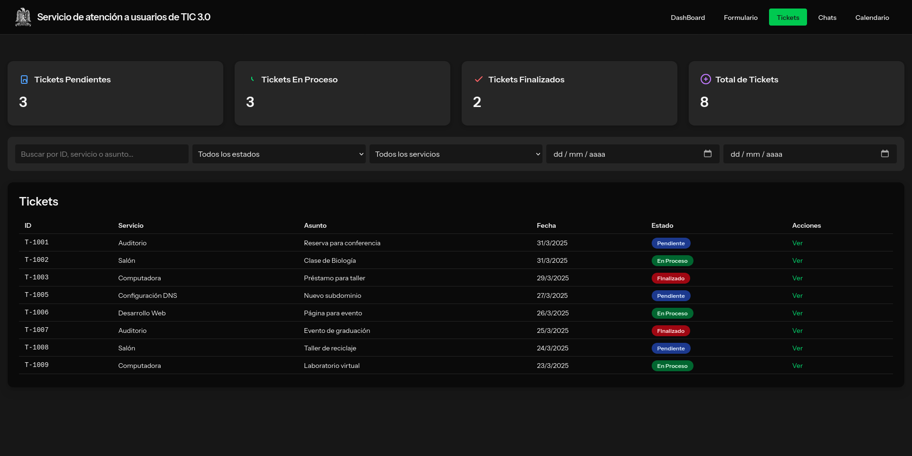
  
<em>🛠️ Visualización del historial y estado actual de tickets generados.</em>

  <h3>💬 Chat de Soporte</h3>
  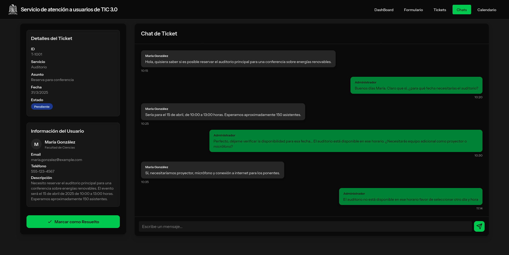
  
<em>🗨️ Comunicación directa en tiempo real con el equipo de soporte.</em>

  <h3>📅 Calendario Personal</h3>
  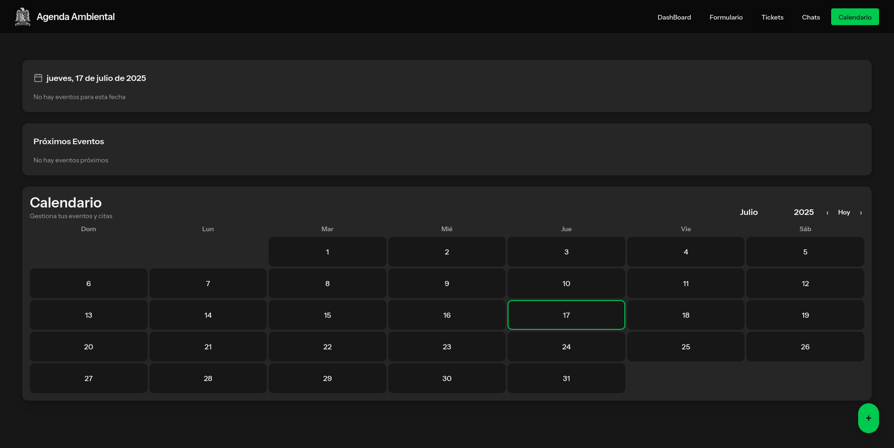
  
<em>📆 Consulta de eventos y actividades programadas relacionadas con los tickets o solicitudes.</em>

  <h3>📥 Encuesta de Satisfacción</h3>
  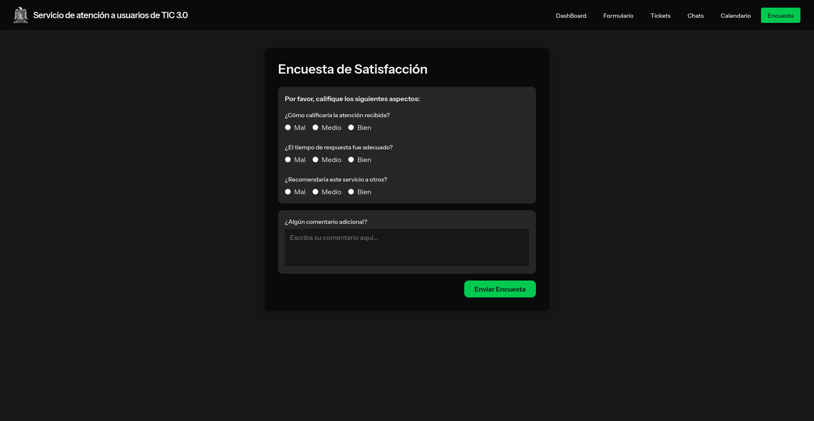
  
<em>🔧 Evaluación del servicio recibido para mejora continua del sistema.</em>

---
